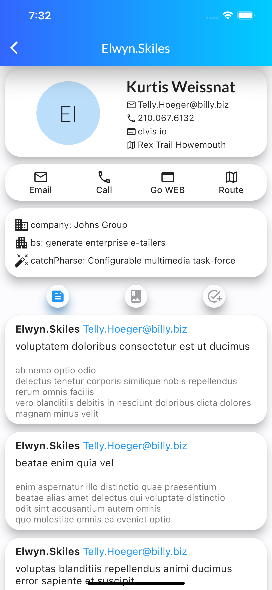

# Flutter JSONPlaceholder example

Flutter app example of using fake REST API.

[JSONPlaceholder](https://jsonplaceholder.typicode.com/): 
- users
- posts
- comments
- albums
- photos
- todos

Saving data to cache is implemented using SharedPreferences

## Android Screenshots

User page posts section

User page albums section

User page todos section

User post page

Image view

## Ios Screenshots
User page posts section

User page albums section

User page todos section

User post page

Image view

